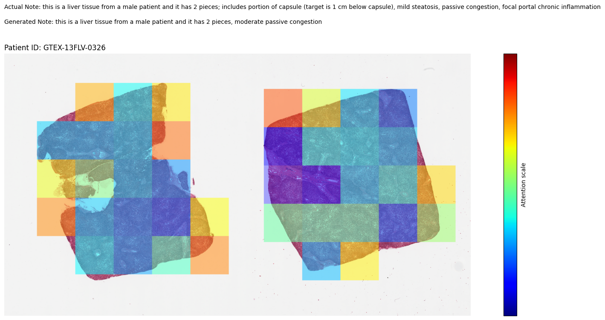

# histo_caption_inference_pipeline

This code implements a full inference pipeline for our captioning technique ([described here](https://github.com/ssen7/histo_cap_transformers)) for our paper utilizing pre-trained Vision Transformers,i.e., [HIPT](https://github.com/mahmoodlab/HIPT) from Chen et al. 2022 and [BioClinicalBERT](https://huggingface.co/emilyalsentzer/Bio_ClinicalBERT) as decoder, and we thank them for sharing their code as it helped us tremendously.

Here is the full inference pipeline in a [Jupyter Notebook](full_inference_pipeline.ipynb).

[Google Drive Link to trained model weights.](https://drive.google.com/file/d/1qwuh0kdRGpcyWVy3XW8LjcyvG4uUus60/view?usp=sharing)

This image shows the attention scores for each patch for generating the caption.



Ref:
```bash
Chen, Richard J., and Rahul G. Krishnan. "Self-supervised vision transformers learn visual concepts in histopathology." arXiv preprint arXiv:2203.00585 (2022).

Chen, Richard J., et al. "Scaling vision transformers to gigapixel images via hierarchical self-supervised learning." Proceedings of the IEEE/CVF Conference on Computer Vision and Pattern Recognition. 2022.
```